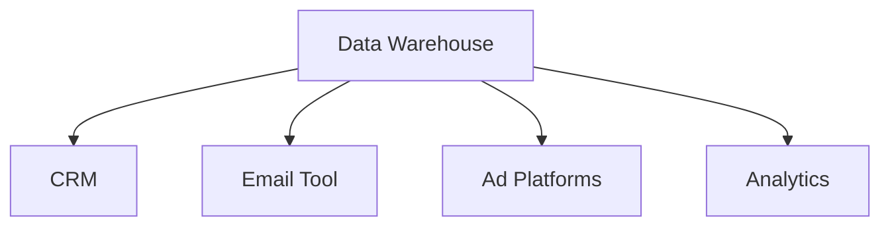

# Cómo Construir un Stack de Marketing Modular en 2025

El marketing moderno requiere agilidad. Las empresas que crecen rápido no pueden permitirse estar atadas a plataformas monolíticas que toman meses para implementar y años para reemplazar.

## El Problema con los Stacks Tradicionales

La mayoría de las empresas construyen su stack de marketing de forma reactiva:

- **Mes 1**: Necesitamos un CRM → Compran Salesforce
- **Mes 6**: Necesitamos email marketing → Agregan Marketo
- **Mes 12**: Necesitamos analytics → Implementan Adobe Analytics

El resultado: **un Frankenstein de herramientas** que no se hablan entre sí, datos duplicados en 5 lugares diferentes, y un equipo de marketing que pasa más tiempo haciendo exports manuales que ejecutando campañas.

## El Enfoque Modular

Un stack modular se construye con tres principios:

### 1. Single Source of Truth



Tu data warehouse (BigQuery, Snowflake, o Supabase) es el centro. Todas las herramientas leen y escriben de ahí.

**Beneficios:**
- Cero duplicación de datos
- Cambiar una herramienta no rompe todo el stack
- Auditable y conforme con regulaciones

### 2. Componentes Intercambiables

Cada módulo hace **una cosa bien** y puede reemplazarse sin afectar el resto:

| Función | Opciones Modulares |
|---------|-------------------|
| Email | Resend, Loops, Customer.io |
| CRM | Attio, Folk, HubSpot Starter |
| Forms | Tally, Fillout, TypeForm |
| Scheduling | Cal.com, Calendly |
| Analytics | PostHog, Mixpanel, Amplitude |

Si Loops no funciona para ti en 3 meses, migras a Customer.io en una tarde, no en un trimestre.

### 3. Automation-First

Usa herramientas de orquestación como **n8n** o **Make** para conectar todo:

```typescript
// Ejemplo: Workflow de Lead Qualification
const leadWorkflow = {
  trigger: "New form submission",
  steps: [
    { action: "Enrich with Clearbit" },
    { action: "Score with custom model" },
    { action: "Route to correct sales rep" },
    { action: "Send to CRM + Slack notification" },
  ]
};
```

## Stack Recomendado para Startups (2025)

Para una startup en fase early-stage con presupuesto &lt;$2K/mes:

**Core:**
- Supabase (Database + Auth)
- Segment (Event Collection)
- n8n (Automation)

**Marketing:**
- Resend (Email)
- PostHog (Analytics)
- Cal.com (Scheduling)

**Sales:**
- Attio (CRM)
- Slack (Communication)

**Costo total:** ~$1,500/mes hasta 50K usuarios

## Implementación Paso a Paso

### Semana 1: Foundation
1. Setup data warehouse
2. Implementar event tracking básico
3. Conectar primeras 2-3 herramientas

### Semana 2-3: Automation
1. Crear workflows críticos (lead routing, nurture sequences)
2. Setup dashboards de métricas clave
3. Documentar arquitectura

### Semana 4: Optimización
1. Agregar enrichment de datos
2. Implementar scoring automático
3. Setup alertas y monitoring

## Errores Comunes

❌ **Usar demasiadas herramientas desde día 1**
✅ Empieza con 3-5 core tools y agrega bajo demanda

❌ **No documentar integraciones**
✅ Mantén un diagrama actualizado de tu stack

❌ **Optimizar antes de tener datos**
✅ Primero captura datos, luego optimiza

## Conclusión

Un stack modular no es más caro ni más complejo que un stack tradicional. Es **más flexible** y te permite moverte rápido sin romper cosas.

En Marsala OS, ayudamos a empresas a diseñar e implementar stacks modulares en semanas, no meses.

---

**¿Necesitas ayuda diseñando tu stack?** [Agenda una llamada](/contact) y te mostramos cómo otras empresas están construyendo sistemas de marketing que escalan.
