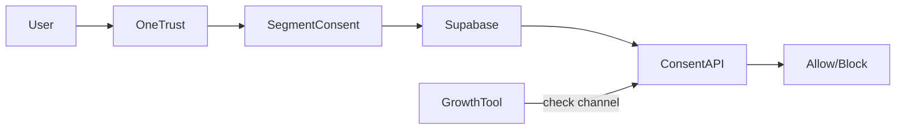

# Privacy Layer for Growth Teams

> There’s no sustainable growth without trust; the privacy layer is my insurance policy.

## Context

I work with sensitive data. To move quickly without violating GDPR or SOC2, I created a privacy layer that abstracts PII, enforces consent, and documents every touch. Instead of waiting on legal for every campaign, growth plugs into governed APIs and gets instant answers (“Yes, you can email this cohort”, “No, delete these records”). Treating privacy like a product gave us velocity without anxiety.

## Stack I leaned on

- Supabase + Row Level Security for governed storage.
- HashiCorp Vault for keys, salts, and secrets.
- Segment consent mode + OneTrust for preference capture.
- PostHog proxy that strips IP/PII before analytics ingestion.
- n8n automations for deletion + audit reporting.
- Metabase dashboards exposing lineage and consent status.

## Data Classification & Contracts

Every field lives in `data-catalog.yml` with:

- Sensitivity tier (Public, Internal, Restricted, Sensitive).
- Lawful basis and purpose.
- Allowed destinations (analytics, ads, support).
- Retention window + auto-deletion schedule.
- Owner + Slack handle.

CI fails if you add a field without owner or retention.

## Privacy Layer Architecture

1. **Consent capture**: OneTrust widget writes preferences → Segment context → Supabase `consent_states`.
2. **Tokenization service**: Node microservice takes email/phone, returns deterministic token; Vault stores salts so only authorized services can detokenize.
3. **Access proxy**: Client SDKs hit our proxy; we drop IP, geo, device info unless consent allows it.
4. **Permission graph**: Supabase table mapping teams ↔ datasets ↔ operations; RLS enforces at query time.
5. **Audit pipeline**: n8n aggregates access logs, schema changes, and deletion events → legal Slack + weekly PDF for auditors.

## Playbook

1. **Classify data** and document purpose in Git (reviewed by legal + data).
2. **Tokenize PII** before leaving the core DB; marketing/ads only see hashed IDs.
3. **Consent API everywhere**: before any campaign, call `consent.canSend(user, channel)`; if false, abort automatically.
4. **Log every use**: jobs writing/reading restricted data log metadata (who, why, purpose) to Supabase.
5. **Automate deletions**: deletion requests trigger n8n flow across Supabase, PostHog, CRM, S3 backups with SLA 48h.
6. **Review new tools**: Linear “Privacy Intake” collects scope; once approved, metadata syncs to dashboards so legal sees every destination.

### Consent API Example

```ts
import { consent } from "@marsala/privacy-sdk";

async function canSendUpsell(userId: string) {
  const decision = await consent.canSend({
    userId,
    channel: "email",
    purpose: "upsell_sequence_q1",
  });
  if (!decision.allowed) {
    throw new Error(`Consent denied: ${decision.reason}`);
  }
}
```

Developers call this helper everywhere instead of rolling their own checks.

### Deletion Workflow

1. User submits request via portal (or DPA email).
2. n8n flow fetches tokens, looks up all destinations via `data_usage_logs`.
3. Executes deletion/anonymization per service (Supabase, PostHog, CRM, S3 backups).
4. Writes completion report to Supabase + sends PDF to legal/compliance.
5. Updates customer record with “erasure complete” timestamp.

SLA is 48h; alerts fire at 24h and 36h if still open.

## Consent Workflow



Experiments, emails, ads, and AI prompts call the API before running; we log every decision.

## Metrics & telemetry

- Deletion requests served in &lt;48h (avg 16h).
- Privacy incidents in 2024: 0.
- Time to approve new tools: -40%.
- Consent coverage: 98% of outbound touches logged via ConsentAPI.
- Manual legal reviews per campaign: -55%.
- Number of unauthorized queries blocked per month: 42 (great signal the layer works).
- Data purpose expirations handled automatically: 100%.

## Dashboards & Reporting

Metabase privacy board shows:

- Data flow diagram (source → destination) with purpose tags.
- Consent opt-in/out trends per channel.
- Upcoming retention expiries (“Trial data expiring in 7 days”).
- Access anomalies (restricted data queried outside business hours).
- Self-serve audit export (CSV+PDF).

Legal no longer asks for screenshots—they open the dashboard.

## Culture & Adoption

- We host quarterly “Privacy + Growth” show-and-tells to demo wins (e.g., faster approvals).
- Slack shortcut `/privacy-route` explains how any new idea should flow through the layer.
- Every growth engineer has “privacy OKR” tied to reducing manual reviews.
- During onboarding, new hires configure the SDK in a sample project and run deletion drills.

## Implementation Timeline

- **Week 1**: Inventory data, classify fields, stand up Supabase policies.
- **Week 2**: Build tokenization + consent APIs, migrate key services.
- **Week 3**: Connect dashboards (Metabase, Grafana), build deletion automation.
- **Week 4**: Roll out SDK updates across growth repos, run privacy drill, present to legal.

In under a month we went from ad-hoc approvals to a governed system—because we treated it like a sprint, not a side project.

Ignoring privacy would have cost us far more (fines, lost trust, slower launches); the layer pays for itself every week a PMM ships without waiting on a committee.

## FAQ

- **Who owns the privacy layer?** Growth Ops builds it, Legal governs policies, Engineering maintains infra. Shared ownership keeps it alive.
- **Do experiments slow down?** No—decisions happen faster because consent + data usage is clear.
- **What about vendors without strong privacy controls?** We either proxy them (PostHog proxy) or block the integration. No exceptions.

## Case Study: AI Support Pilot

When support wanted to pilot AI-generated replies, legal panicked. Using the privacy layer we:

1. Tagged support transcripts as Sensitive; only anonymized versions flow to AI providers.
2. Ran prompts through the Consent API to ensure only opted-in customers receive AI-generated drafts.
3. Logged every AI request with purpose + retention (30 days) and auto-deleted transcripts after expiry.
4. Surfaced usage metrics + audit logs in Metabase so legal saw exactly which tickets used AI.

Result: pilot approved in 48 hours instead of weeks, and we passed the SOC 2 audit with zero notes.

## Developer Experience

- `@marsala/privacy-sdk` exposes helpers (`tokenizeEmail`, `canSend`, `withPrivacyContext`).
- ESLint plugin forbids importing raw PII modules outside allowed directories.
- Storybook stories include consent toggles so designers understand states.
- VS Code snippets insert metadata headers when creating new data fields or prompts.

We make the safe path the easy path.

## Governance Rituals

- **Monthly privacy council** reviews new tools, unresolved incidents, risky experiments.
- **Quarterly contract audit** updates retention, owners, lawful bases.
- **Training refreshers** (Loom + quiz) for growth squads.
- **Incident drills** simulate breaches; we practice revoking tokens, notifying customers, regenerating salts.

## Cost Snapshot

- Supabase Pro: $25/mo (policies + audit logs).
- Vault (HCP): $36/mo.
- OneTrust: already company-wide; incremental $0.
- n8n on Fly.io: $15/mo.
- Engineering time: 1 day/month to maintain catalog + automations.

Cheap insurance compared to fines or lost trust.

## What stuck with me

- Legal needs real-time visibility of where data travels.
- Teams accept constraints when they see the upside (fewer endless forms).
- Tokenization must be purpose-specific; reuse causes compliance headaches.
- Build privacy checks into CI and QA so issues fail fast.

## What I'm building next

I’m building a CLI that lists which services touch PII and flags expired data purposes. Want to beta test it? ping me.

---

Want me to help you replicate this module? [Drop me a note](/contact) and we’ll build it together.
